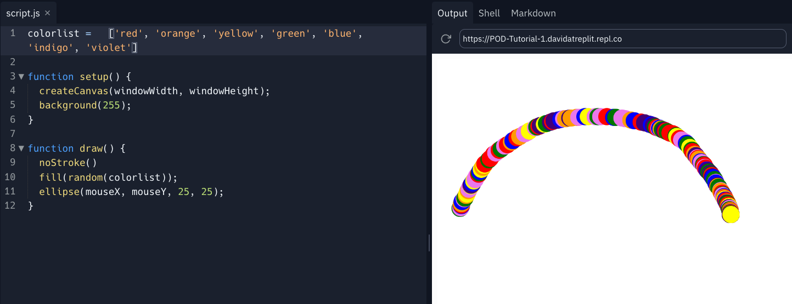

# 1. Let's Get Coding! 

In this chapter you will learn the basics of Replit workspace and run a simple drawing program


## Let's summarize:
- Editing happens in  the *Files* tab (in this case, `script.js`).
- `Boilerplate code` is the example code you may find in a file when you are getting started.
- The `Markdown` tab is your guide and where to find instructions.
- The `output` is what your program is actually doing when it's running and where you need to go to see what you have achived so far.
- The `run` button is what you use to make your code come alive.


##  👉 Your turn

Replace the first line of code with the one below, then click run and see what difference that makes.

```javascript
colorlist =   ['red', 'orange', 'yellow', 'green', 'blue', 'indigo', 'violet']
```
Yes, it's a rainbow! 🌈 Well… sorta.




### Now, every good artist should know their canvas. Let's do that in the next step. 🧑‍🎨
