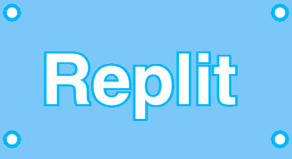

# 4. Challenge: Your Name in Lights!

Goal : Get creative by experimenting with the skills you have learned in lesson 1, 2 and 3.


##  👉 Your turn

Following code will add in a 'lightbulb' 
```javascript
ellipse(20, 20, 20);
``` 
- let's stick in a few more to surround your name as if it was an actual lightbulb border



- The styling of these lightbulbs use the same code as the styling of the text.
- Make sure you change the style *before* you add in each `ellipse`


<details>
<summary>Hint 💡</summary>

Try changing the first two of the three (20,20,20) in the ellipse(20,20,20) and see what happens.

For example : ellipse(20,200,20)

</details>


Don't forget to [join our community](ask.replit.com) and share what you have learned!


PS. Go to the fixing code errors module to learn the top three bug errors and how to fix them.

### Next, let's reorganize the code to make it efficient ⚙️ 