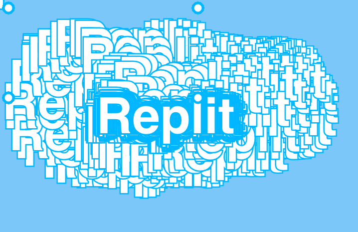

# 5A. Let's Reorganise a bit


<details>
<summary>Show me the code</summary>

```javascript
colorlist =   ['red', 'orange', 'yellow', 'green', 'blue', 'indigo', 'violet']

function setup() {
  createCanvas(windowWidth, windowHeight);
  background('lightskyblue');
  fill('white');
  textFont("sans-serif");
  textSize(100);
  textAlign(CENTER);
  textStyle(BOLD);
  stroke('deepskyblue');
  strokeWeight(5);
  bgImg = loadImage("clouds.jpg");
  colorIndex = 0;
}

function draw() {

  image(bgImg, 0, 0, width, height);
  text("Replit", mouseX, mouseY);


}
```

</details>


## Let's Summarize:
- Everything in the `draw()` method happens **sixty times a second**, so...
- We want to take all the code in the `setup()` method that doesn't change and *refactor* it.
- Instead of the computer automatically choosing where the text will appear in pixels on our canvas (remember 200 and 100 from module 2b),you can decide the mouse location of `x` and `y`.


<details> 
  <summary> Your code should look similar to this after module 3:</summary>
  
```javascript
function setup() {
  createCanvas(windowWidth, windowHeight);
  background('lightskyblue');
  fill('white')
  textFont("Helvetica")
  textSize(100)
  textAlign(CENTER);
  textStyle(BOLD);
  stroke('deepskyblue');
  strokeWeight(5);
}

function draw() {
  text("Replit", 200, 150);
  ellipse(20, 20, 20);
  ellipse(20, 200, 20);
  ellipse(400, 20, 20);
  ellipse(400, 200, 20);
}
```
</details>


##  👉 Your turn


Let's swap that out for the position of the mouse:

```javascript
text("Replit", mouseX, mouseY);
```

Hit `run`.



### It's moving, but leaving a trail. Learn how to fix this in the next module by adding an image.