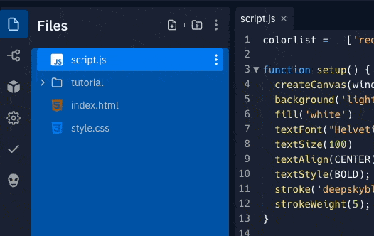

# 5B: Upload an image

Learn how to upload an image to your repl (any images or files you add are called assets) and set it as the background for your canvas.


## Let's summarize:
- You can add an image by dragging it into the file tree (that's the space under `Files`) or you can click the `add file` icon.
- You can rename your file (try something short with no spaces) by clicking the kebab (three vertical dots) button next to the file and selecting rename.
- The variable `bgImg` stores the image and allows you to use it anywhere else in the code.
- The background code needs to be the first line of your `draw` method.

##  👉 Your turn

- Upload your image (drag it into the file or choose `add file`) and rename it..
  



Add this to your `setup` method:

```javascript
bgImg = loadImage("clouds.jpeg");
```
**Make sure the file name inside the `("")` matches the file name in your file tree. (See how both of mine are "clouds").**


Set the background with this code: 

- Remember, this needs to be the first line in your `draw` method so it replaces the background image before anything is drawn.

```javascript
image(bgImg, 0, 0, width, height);
```


## Extra Credit
1. You can use an **offset** to have the rest of your words follow your mouse *and* still stay in the right order. Try changing up your other words to something like this

```javascript
text("Surname", mouseX+100, mouseY);`
```

then mess with the numbers to see what looks right.

2. Do those elipses need moving or *re*moving? Either find a way to get them to float around the mouse (as we've done with the words), push them properly to the corners or remove them - the world's your oyster!

### Next let's crash the code and fix it!