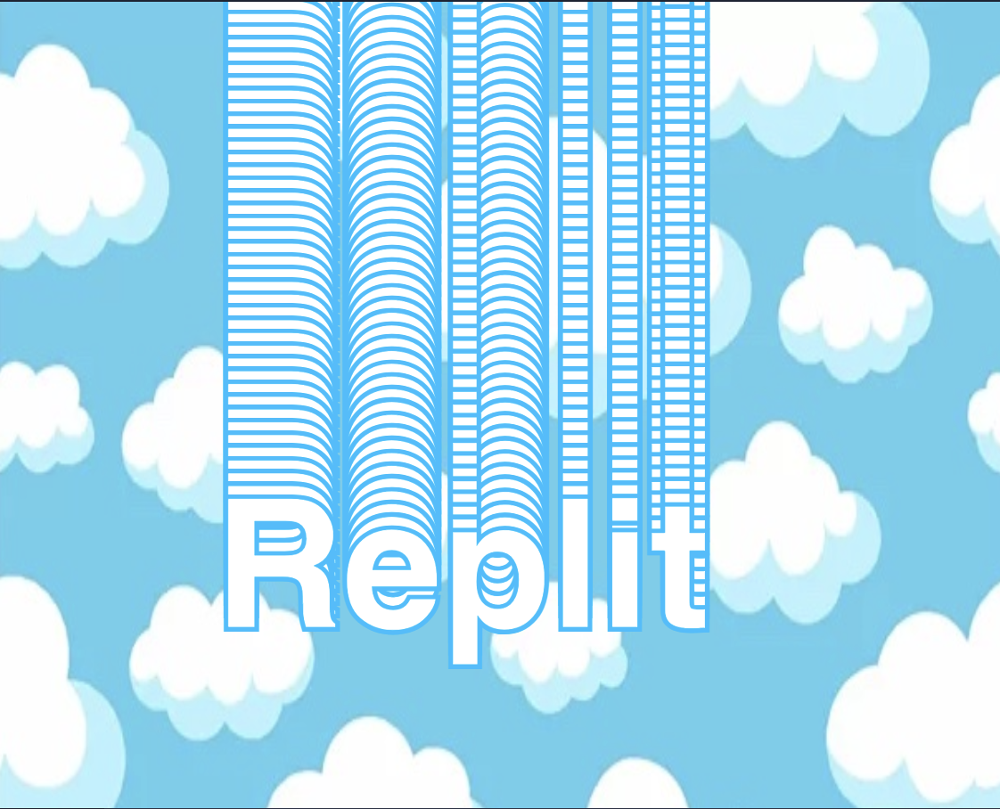
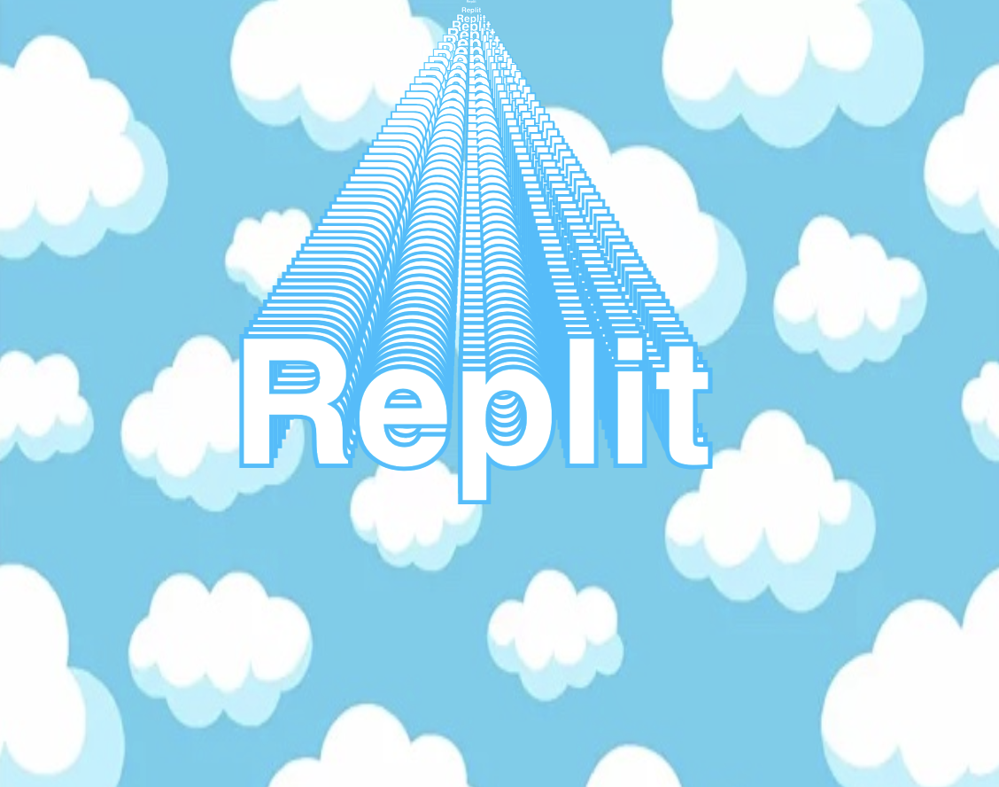

# 9. Loops for the Win

In this chapter you will use *for loop* to make copies of your text in different size


<details>
<summary>tl;dr</summary>

```javascript
colorlist =   ['red', 'orange', 'yellow', 'green', 'blue', 'indigo', 'violet']

function setup() {
  createCanvas(windowWidth, windowHeight);
  background('lightskyblue');
  fill('white');
  textFont("sans-serif");
  textSize(100);
  textAlign(CENTER);
  textStyle(BOLD);
  stroke('deepskyblue');
  strokeWeight(5);
  bgImg = loadImage("clouds.jpg");
  colorIndex = 0;
}

function draw() {

  image(bgImg, 0, 0, width, height);

  for (let i = 0; i < 10; i += 1) {
    x = mouseX;
    y = mouseY*i*1/10;
    push();
    translate(x,y);
    scale(i*1/10);
    text("Replit", 0, 0);
    pop();
   }


}
```

</details>

Right now you have one name floating around, but wouldn't it be cool to add a couple of them (even make them 3D)?

## Let's summarize:
- `for` loop shows a value to start at (`i=0`), a value to go until (`i < 10`), and what value to add each time (`i += 1`).
- `push` (written *before* the `for` loop) and (`pop` written *after*) help store and reload the current style of the text.
- `translate` will reposition the text around specific points by specifying `x` and `y`.
- `scale` resizes something.

##  👉 Your turn

**Simplify your code by eliminating everything in the `draw` method except for `image`.**


- Add a `for` loop to `draw`
- The `i= 0` says to start at 0, the `i < 10` means to use numbers 0-9, and `i += 1` means the number will increase one at a time

```javascript
  for (let i = 0; i < 10; i += 1) {
    text("Replit", mouseX, mouseY);
   }
```


- `push` and `pop` let us store and reload the style we have currently. Nothing's changes when we run it - so let's keep going.


```javascript
  for (let i = 0; i < 10; i += 1) {
    push();
    text("Replit", mouseX, mouseY);
    pop();
   }
```
- The `for` loop makes the 10 copies of my code stacked on top of each other.
- Use `translate` to move the code to different locations instead of `mouseX` and `mouseY` 

```javascript
  for (let i = 0; i < 10; i += 1) {
    x = mouseX;
    y = mouseY;
    push();
    translate(x,y);
    text("Replit", 0, 0);
    pop();
   }
```


- Change the `y` based on the loop variable so the text is drawn at a slightly different height each time.

- Place each version at a 10% gap by adding `*i*1/10` to the `y=` code.


```javascript
  for (let i = 0; i < 10; i += 1) {
    x = mouseX;
    y = mouseY*i*1/10;
    push();
    translate(x,y);
    text("Replit", 0, 0);
    pop();
   }
```



Well… that's something, it looks like a slinky glued to the top of the screen! 

 
- When the `loop variable` is included, the overall size and `scale` change each time it draws. 

- Add `scale(i*0.1);` under the `translate` line.


```javascript
  for (let i = 0; i < 10; i += 1) {
    x = mouseX;
    y = mouseY*i*1/10;
    push();
    translate(x,y);
    scale(i*1/10);
    text("Replit", 0, 0);
    pop();
   }
```



### Ahh now we're getting somewhere!
That looks like it's stretching back into infinity, and it follows your mouse in a really cool way!

### Let's cycle through some colors next 🟦🟨🟥🟩🟧