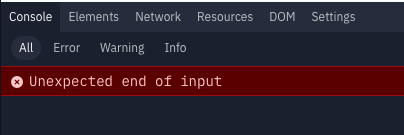
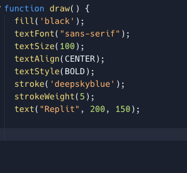
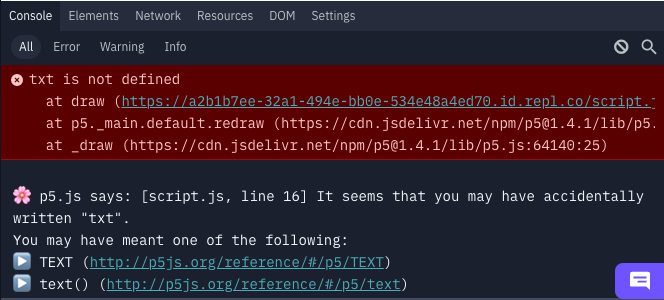
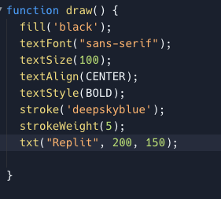
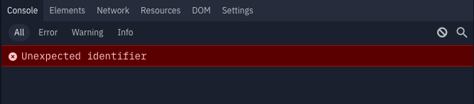
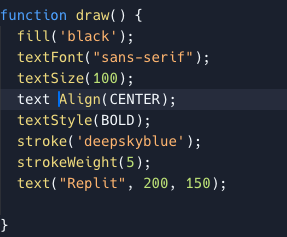

# Extra : What if it crashes? 😭

Don't worry about it - even professional software developers crash their code. Let's take a look at how we can **debug** what you've got.

Let's take a look at some common issues you might face.

### Where my {} at?

One of the most common errors you might see is this

which translates as 'You've deleted the closing curly brace' - take a look

Which you can fix by adding a `}` at the end and trying again. You might also see a similar error if you've not closed your parenthesis `( )` or even your square brackets `[ ]`. Make sure if there's a starting one, there's an ending one somewhere. Oh yeah, quotes too! `''` `""`

### Spell those Commands right!

What about this **huge** error?

Well that's actually trying to be quite nice to us, it's given us an error that `txt is not defined` and then suggested that we may have meant to type `text`. Well, shucks, we did!

We'll replace `txt` with `text` and boom - we're done.

### Spaces aren't your friend

I love this message. 😒

It's the vaguest thing you've ever seen! Well that's just its way of saying `I've found this thing, and I don't know what it is` and normally happens if you accidentally put a space in a thing that didn't need one. Commands and variable names don't have spaces, if you pop one in you're in for the world of `Unexpected identifiers`

This is where the *syntax highlighting* helps - see that random bit of white text? Yeah, we've put a space in the wrong place. Whip it out and you're good to go!

### Ummmm…still not sure?

If something breaks read the error message 🤓 
- it might suggest how to fix it,
- it might give you the line number the error is on
- if all else fails, take the error and stick it in a search engine.

Otherwise why not reach out to our wonderful community and see if they can set your right?
